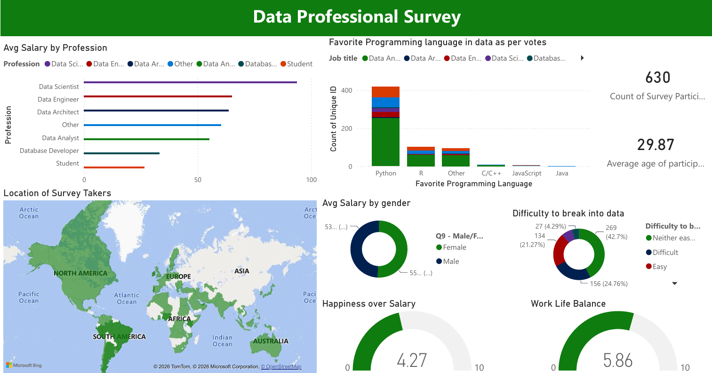

# 📊 Data Professional Survey — Power BI Dashboard


> 🌍 An interactive Power BI dashboard built on **630 real-world survey responses** from data professionals across **98 countries** — uncovering salary trends, happiness scores, career-switch patterns, and tool preferences across the global data industry.

---

## 📸 Dashboard Preview



---

## 📌 Project Overview

This end-to-end Power BI project analyzes a global survey conducted among professionals in the data industry. Respondents include Data Analysts, Data Scientists, Data Engineers, Data Architects, and Database Developers from **98 countries**, spanning industries like Tech, Finance, Healthcare, and Education.

The raw Excel data was cleaned and reshaped using **Power Query**, and key metrics were built with **DAX** to surface meaningful insights about salaries, workplace happiness, career transitions, and tool preferences — all presented through an interactive single-page dashboard.

---

## 🎯 Key Questions Explored

* 💰 How do **salaries differ** across data roles and regions?
* 😊 How **happy** are data professionals with salary, work-life balance, management & growth?
* 🐍 Which **programming language** dominates the data world?
* 🔄 What percentage of professionals **switched careers** into data — and was it hard?
* 🌐 Where in the world are data professionals located?
* 🎓 What **education level** is most common in the field?
* 🔍 What do professionals **prioritize most** when looking for a new job?

---

## 📊 Key Findings (From Real Data)

| Metric                   | Finding                                                       |
| ------------------------ | ------------------------------------------------------------- |
| 👥 Total Respondents     | **630 survey participants**                                   |
| 🌍 Countries Represented | **98 countries**                                              |
| 🎂 Average Age           | **29.87 years**                                               |
| 🔄 Career Switchers      | **59% switched into data** from another field                 |
| 🐍 Top Language          | **Python** — chosen by 420 out of 630 respondents (66.7%)     |
| 💰 Salary Happiness      | **4.27 / 10** — professionals are not very satisfied with pay |
| ⚖️ Work-Life Balance     | **5.74 / 10** — moderate satisfaction                         |
| 🤝 Coworker Happiness    | **5.86 / 10** — highest rated workplace metric                |
| 📈 Upward Mobility       | **4.76 / 10** — growth opportunities feel limited             |
| 🎓 Top Education         | **Bachelor's degree** — held by 52.2% of respondents          |
| 🏆 #1 Job Priority       | **Better Salary** — cited by 47.1% of respondents             |
| 🏅 Top Country           | **United States** — 261 respondents (41.4% of total)          |

---

## 💡 Insights & Story

### 1. 🔄 Breaking In Is Hard — But People Do It Anyway

59% of survey respondents switched careers into data from a different field. Yet the majority described breaking in as *"Neither easy nor difficult"* to *"Difficult"*, suggesting determination over smooth entry paths.

### 2. 💸 Salary Satisfaction Is a Pain Point

Salary happiness scored just **4.27 out of 10** — the lowest across all 6 workplace happiness metrics. Despite data roles paying well in absolute terms, professionals feel underpaid relative to expectations.

### 3. 🐍 Python Is King

Python was the favourite programming language for **66.7% of respondents**, dwarfing R (16%) and SQL variants. This signals Python as the non-negotiable skill for anyone entering the data field.

### 4. 🤝 People Like Their Colleagues More Than Their Pay

Coworker happiness (**5.86/10**) and work-life balance (**5.74/10**) scored significantly higher than salary satisfaction (**4.27/10**) — suggesting culture and team dynamic matter more than compensation in day-to-day satisfaction.

### 5. 💼 Better Salary Is the #1 Career Driver

When asked what they'd prioritize in a new job, **47.1% said "Better Salary"** — followed by Remote Work (20.2%) and Work-Life Balance (18.6%).

---

## 🛠️ Tools & Technologies

| Tool                         | Purpose                                       |
| ---------------------------- | --------------------------------------------- |
| **Power BI Desktop**         | Dashboard design & interactive visualizations |
| **Power Query (M Language)** | Data cleaning, transformation & shaping       |
| **DAX**                      | Calculated measures, KPIs & aggregations      |
| **Microsoft Excel (.xlsx)**  | Source survey data (630 rows × 28 columns)    |

---

## 🔄 Data Transformation (Power Query)

The raw survey data required significant cleaning before it could be visualized. Key transformation steps included:

* ✅ Removed irrelevant columns (Browser, OS, Referrer, Email)
* ✅ Standardized free-text job titles into clean role categories
* ✅ Converted salary range strings (e.g. `"41k-65k"`) into numeric midpoint values for averaging
* ✅ Cleaned country names with `"Other (Please Specify):"` prefixes into readable labels
* ✅ Handled null and inconsistent entries across happiness score columns
* ✅ Split and normalized multi-value columns for programming language analysis

---

## 📂 Project Structure

```text
📂 data-professionals-survey-dashboard/
│
├── 📊 Finale_cleaned_datasheet.pbix     # Power BI Dashboard file
├── 📂 data/
│   └── Power_BI_Final_Project.xlsx      # Raw source survey data (630 responses)
├── 📂 screenshots/
│   └── dashboard_overview.png           # Dashboard preview image
└── 📄 README.md                         # Project documentation
```

---

## 🚀 How to View Locally

1. Download and install **[Power BI Desktop](https://powerbi.microsoft.com/desktop)** — it's free
2. Clone this repository:

```bash
git clone https://github.com/abhirupdas99/global-data-professionals-analysis-using-Power-BI.git
```

3. Open `Finale_cleaned_datasheet.pbix` in Power BI Desktop
4. Interact with the slicers, filters, and visuals to explore the data

---

## 📈 Skills Demonstrated

```text
✔ Data Cleaning & Transformation        Power Query / M Language
✔ Calculated Measures & KPIs            DAX (AVERAGE, CALCULATE, COUNTROWS, DIVIDE)
✔ Data Modelling                         Relationships & schema design
✔ Interactive Dashboard Design           Slicers, filters, drill-through, tooltips
✔ Survey Data Analysis                   Handling real-world, messy, unstructured data
✔ Data Storytelling                      Insight-driven visual layout & narrative
✔ Geographic Visualisation               Map visual across 98 countries
```

---

## 📋 Dataset Overview

| Property          | Detail                               |
| ----------------- | ------------------------------------ |
| Source            | Global online survey (2022)          |
| Total Responses   | 630                                  |
| Total Columns     | 28                                   |
| Countries Covered | 98                                   |
| Top Industries    | Tech, Finance, Healthcare, Education |
| Salary Range      | $0–40k to $225k+ (USD, yearly)       |
| Happiness Scale   | 0–10 (across 6 workplace dimensions) |

---


This is the same README content from your uploaded file, formatted so you can **copy → paste directly into GitHub's `README.md`**.
```
